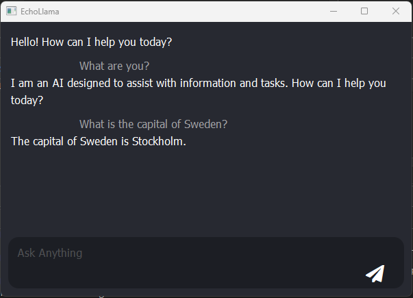
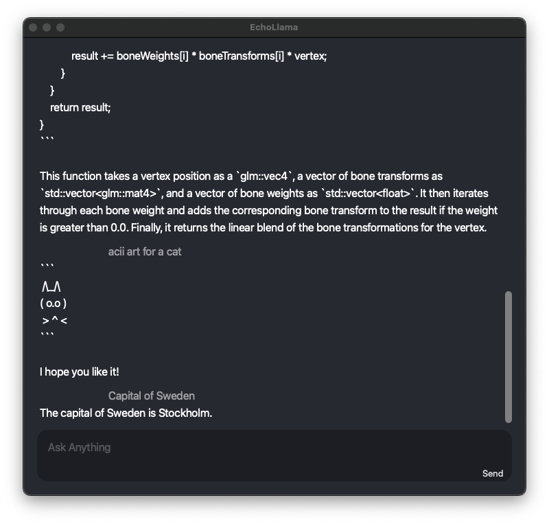

# LlamaEngine  

**A cross-platform C++ library for dynamically loading and running llama.cpp with CPU, CUDA, Vulkan, and Metal backends.**  

LlamaEngine provides a dynamic way to integrate LLMs into native applications, enabling efficient **LLM interaction, prompt engineering, and natural language processing (NLP)** through backend selection and fine-grained AI context control. It allows **C/C++ clients** to load LLM models, such as **GGUF files** from **Hugging Face**, query metadata, and run inferences on various hardware backends supported by **llama.cpp**.  

This project is a module spin-off from [**StarGit**](https://stargit.com), now an open-source initiative aimed at enhancing local AI-driven development and automation pipelines — without relying on cloud services, ensuring **security, transparency, and cost-effectiveness** for developers and enterprises.  

---

**EchoLlama*, the demo client for LlamaEngine, running on Windows:
  

---

## **Key Features**  

- **AI-Powered Automation**: Serves as a backend for **automated AI analysis and process optimization**. 
- **Multi-Backend Support**: Load and run models with **CPU, CUDA, Vulkan, or Metal** backends.  
- **Dynamic Library Loading**: Select and switch backends at runtime without recompiling.  
- **GGUF Metadata Parsing**: Extract model metadata, including parameters and context size.  
- **Prompt-Based Response Generation**: Generate AI responses via the **LlamaModel API**.  
- **Native C/C++ API**: Seamless integration for applications interfacing with LlamaEngine.  
- **Cross-Platform**: Compatible with **Windows, macOS, and Linux**.  
- **Security & Transparency**: Designed for **on-premise AI execution**, ensuring full **source code analysis** and **security auditing**.   

## Build Instructions  

## **Build Instructions**  

### **Requirements**  
LlamaEngine depends on **llama.cpp**, which must be **built from source** and structured as specified in the `.pro` file.  

A `llama_version.h` file is also required, containing build metadata for `llama.cpp`:  

```cpp
#ifndef LLAMA_VERSION_H
#define LLAMA_VERSION_H

#define LLAMA_COMMIT_VERSION "gguf-v0.4.0-3477-ga800ae46"
#define LLAMA_COMMIT_DATE "Wed Feb 26 15:26:52 2025 +0100"
#define LLAMA_COMMIT_HASH "a800ae46da2ed7dac236aa6bf2b595da6b6294b5"

#endif // LLAMA_VERSION_H
```

### **Automation**  
Python scripts are provided to **package llama.cpp shared libraries** and **generate `llama_version.h` automatically**:  

- **Windows:** `bundle_llama.cpp_windows.py`  
- **macOS:** `bundle_llama.cpp_macos.py`  

### **Notice**  
Currently, to build **LlamaEngine**, users may need to **modify the Python scripts and `.pro` file** to set the correct location of the **llama.cpp** dependency.  

#### **Future Improvements**  
The build process will be further refined, and **prebuilt binaries** are planned for upcoming releases.  

### Using QMake (Recommended)  

You can build the libraries using **qmake** or through **QtCreator**.  

```bash
qmake LlamaEngine.pro
make
```

### Generate Visual Studio Projects (Windows)  

On Windows, you can generate **Visual Studio** projects for different backends:  

```powershell
qmake -tp vc LlamaEngine.pro BACKEND=CUDA
qmake -tp vc LlamaEngine.pro BACKEND=CPU
qmake -tp vc LlamaEngine.pro BACKEND=Vulkan
```

Each generated project must be **compiled separately** using **Visual Studio**.  

### Future CMake Support  

A **CMake build system** is planned for future versions to enhance cross-platform compatibility and integration with modern build environments.  

## Integration with C++ Applications  

A **C++ client**, `LlamaClient`, is available for interfacing with applications. This client allows for:  

- **Loading and querying LLM models** dynamically.  
- **Managing AI context and fine-tuning responses**.  
- **Interacting with different llama.cpp backends** seamlessly. 

## Use Case in StarGit   

LlamaEngine is integrated into [**StarGit**](https://stargit.com) to enable **AI-driven Git workflows**, including:  

- **Natural Language Git Commands**: AI-assisted Git interactions.  
- **Development Pipeline Analysis**: Identify potential issues and suggest improvements.  
- **Source Code Security Analysis**: Detect vulnerabilities in commits.  
- **Code Review & Diff Analysis**: AI-assisted PR reviews.  
- **Commit Message Generation**: AI-powered commit messages based on code changes. 
- **AI-Powered Automation**: AI-driven development workflows and task optimizations. 

This ensures that **LLM capabilities** are embedded **directly into the development process**, enhancing **security and automation** without external dependencies.  

## Roadmap & Future Enhancements  

- **Session Management**: Support for managing multiple AI contexts simultaneously.  
- **Concurrency & Thread Safety**: Improve parallel processing capabilities.  
- **Fine-Tuned AI Prompt Engineering**: Enhanced control over model responses.  

## Performance & Optimization  

LlamaEngine aims to balance **modern C++20 features** with **low-level C optimizations** for:  

- **Efficient memory management** to handle large AI models.  
- **Optimized computation pipelines** for backend performance.  
- **Minimizing latency in prompt processing**.  
- **Dynamic backend selection** for best performance trade-offs.   

## Why LlamaEngine?  

Unlike cloud-based AI integrations, **LlamaEngine** offers a **local, transparent, and cost-effective** alternative for AI-driven software development. By combining **dynamic backend selection, security, and performance optimizations**, it provides an ideal solution for developers, researchers, and AI enthusiasts looking to integrate **LLMs into their workflows**.  

You can add a section in the main `README.md` that provides a brief overview of key features and then link to `docs/USAGE.md` for more detailed examples. Here's how you could structure that section, with a focus on `generateResponse` using a lambda and `loadModel`.

# LlamaClient

LlamaClient is a simple interface for interacting with the Llama model and load the runtime driver. Below are some highlights showcasing how to use LlamaClient for common tasks like generating a response with a lambda function and loading a model into memory.

## Key Features

### 1. Load Model into Memory

To use the model, you first need to load it into memory with the appropriate parameters. This step ensures that LlamaClient can use the model for generating responses.

```cpp
// Example of loading a model into memory
float temperature = 0.7f;
int contextSize = 4096;  // Increase context size
float topK = 40.0f;
float topP = 0.9f;
float repetitionPenalty = 1.2f;
std::string modelPath = "path/to/your/model";  // Replace with actual model path

struct ModelParameter params[] = {
    {"temperature", PARAM_FLOAT, &temperature},
    {"context_size", PARAM_INT, &contextSize},
    {"top_k", PARAM_FLOAT, &topK},
    {"top_P", PARAM_FLOAT, &topP},
    {"repetition_penalty", PARAM_FLOAT, &repetitionPenalty},
    {"model_path", PARAM_STRING, (void*)modelPath.c_str()}
};

size_t paramCount = sizeof(params) / sizeof(params[0]);

if (!client->loadModel(modelPath, params, paramCount, [](const char* message) {
    std::cout << "Model loading: " << message << std::endl;
})) {
    std::cerr << "Failed to load model!" << std::endl;
    delete client;
    return 1;
}
```

### 2. Generate Response with Lambda

You can generate responses without needing to manually manage sessions. This is done by calling `generateResponse` and using callbacks to handle the stream of tokens and the final result.

```cpp
// Example of using generateResponse with lambda callbacks
client->generateResponse("Hello, Llama!", 
    [](const char* msg, void* userData) {
        std::cout << msg;  // Streamed tokens
    }, 
    [](const char* msg, void* userData) {
        std::cout << "\nFinal Response: " << msg << std::endl;  // Final response
    }, 
    nullptr);
```

## Get Started

To get started with LlamaClient, check out the full usage examples in [docs/USAGE.md](docs/USAGE.md).

Here's a section for your `README.md`:  

---

## EchoLlama  

EchoLlama is a Qt-based chat client for interacting with Llama models. It is located in the `EchoLlama` subdirectory and requires the compilation of **LlamaEngine** in the project root directory.  

### Compilation & Dependencies  

To run EchoLlama, you need to build **LlamaEngine** and ensure the required **llama.cpp** libraries are available in the correct architecture-specific locations.  

For macOS (debug build), libraries should be structured as follows:  

```
LlamaEngine/EchoLlama/build/Qt_6_7_0_for_macOS-Debug/EchoLlama.app/Contents/MacOS/
├── llama.cpp/gguf-v0.4.0-3352-g855cd073/metal/
│   ├── libLlamaEngine.1.dylib
│   ├── libggml.dylib
│   ├── libggml-base.dylib
│   ├── libggml-blas.dylib
│   ├── libllama.dylib
│   ├── libggml-cpu.dylib
│   ├── libggml-metal.dylib
```

You can adjust the library path in **EchoLlama** by modifying the `initializeLlama` function:  

```cpp
void EchoLlama::initializeLlama() {
#ifdef __APPLE__
    const char* enginePath = "llama.cpp/gguf-v0.4.0-3352-g855cd073/metal/libLlamaEngine.1.dylib";
#elif WIN32
    const char* enginePath = "LlamaEngine.dll";
#else
    const char* enginePath = "LlamaEngine.so";
#endif
}
```

### Bundling LlamaEngine on macOS  

A Python script is provided to assist in bundling `libLlamaEngine.1.dylib` and the required `llama.cpp` libraries for macOS.  

#### Usage  

For **debug mode**:  
```sh
python bundle_llama.cpp_macos.py debug
```

For **release mode**:  
```sh
python bundle_llama.cpp_macos.py release
```

You may need to adjust paths depending on your system's Llama.cpp root and build directory.

---

## Running EchoLlama  

Once compiled, launch `EchoLlama` and start prompting the model. Here's a preview of EchoLlama running on macOS:  

  

## License

This project is licensed under the MIT License - see the [LICENSE](./LICENSE) file for details.


